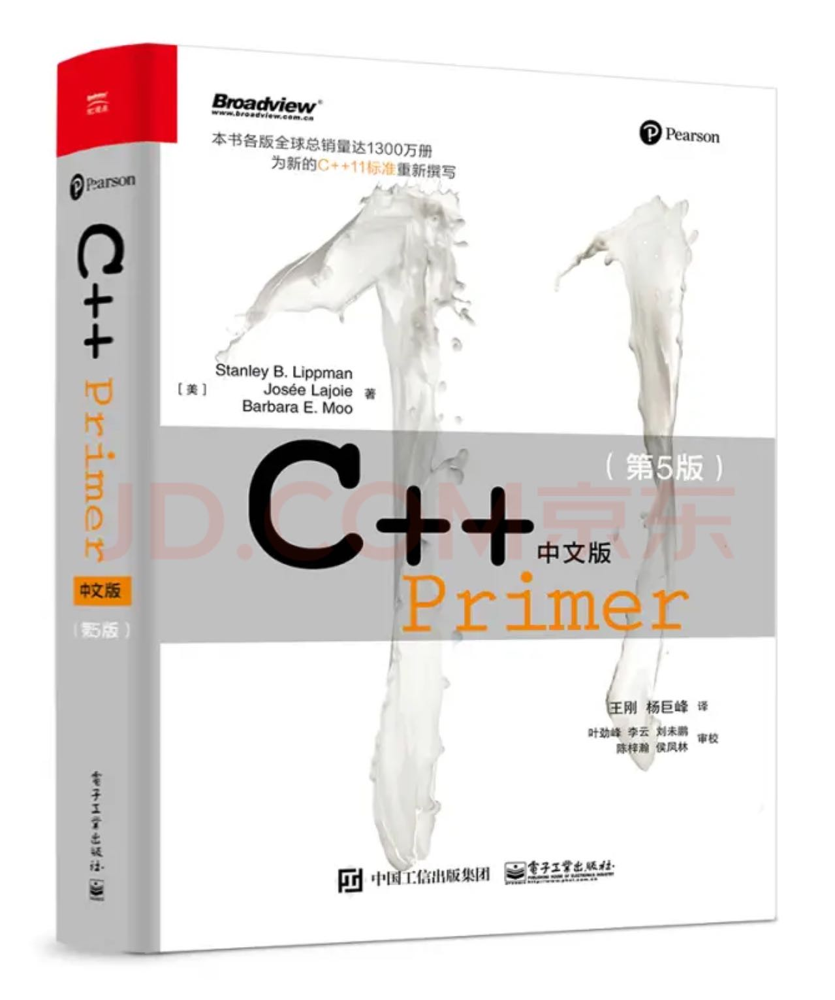

<!--
 * @Author: Jimmy Hua
 * @Date: 2022-07-31 21:04:31
 * @LastEditTime: 2022-07-31 21:26:31
 * @FilePath: /C++Primer/README.md
 * @Description:
 * Copyright (c) 2022 by Jimmy Hua, All Rights Reserved.
-->

# 📔 Learning Daily for C++ Primer 5th

## 1. 简介

🎯 本个 Repo 主要是记录 C++ Primer 的整个学习过程，其中包括了完整的学习笔记和课后练习答案。

**书籍：**《C++ Primer 中文版（第 5 版）》

## 2. 运行环境

- system: Mac OS
- IDE: VS Code
- compiler: g++

### 3. 学习目录

- [第 1 章：开始](./chapter1/README.md)
